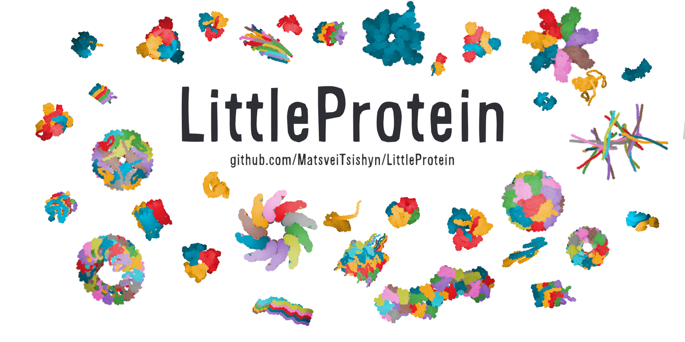

# LittleProtein

[](https://opensource.org/licenses/MIT) [](https://MatsveiTsishyn.github.io/LittleProtein/)
<div style="text-align: center;">

</div>

**LittleProtein** is a **protein 3D structure viewer** that runs in your web **browser**.  
It creates a canvas within an HTML page where you can display and interact with a protein 3D structure.
It is written in JavaScript and uses the [p5.js](https://p5js.org/) library to facilitate display and interactivity.
The goal of the project is to provide a cute little viewer for everyone to play with protein 3D structures and to get coarse-grain schematic graphics of your favorite structures (like the ones shown in the image above).  

**Demo**: https://MatsveiTsishyn.github.io/LittleProtein/

## Usage

### (1) Just play

#### Online Demo
Open the **[Live Demo](https://MatsveiTsishyn.github.io/LittleProtein/)** in your browser. You can immediately start exploring protein 3D structures with an interactive UI:
- Fetch structures directly from the [Protein Data Bank (PDB)](https://www.rcsb.org/) using a PDB ID (e.g., `1ACB`)
- Fetch structures from [AlphaFoldDB](https://alphafold.com/) using a UniProt ID (e.g., `P08397`)
- Load a demo protein structure
- Drag and drop any `.pdb` file to visualize it

#### Local Development
To run LittleProtein Demo locally on your machine, run the following command from directory `./playground/`:
```bash
npm run dev
```

### (2) Include in your own web page

To integrate LittleProtein into your own HTML page, use the `littleprotein.js` script (or build it from source). Here's a basic template similar to [demo.html](demo.html):

```html
<!DOCTYPE html>
<head>
  <script src="littleprotein.js"></script>
</head>
<body>

  <div id="LittleProteinCanvas1"></div>  
  <script>
    const lpCanvas = LittleProteinStarter.start(
      "#LittleProteinCanvas1",  // ID to find the HTML div where to generate the canvas
      1200,                     // width (X coordinate) of the canvas
      800,                      // height (Y coordinate) of the canvas
    );
    lpCanvas.loadDemoProtein(); // Load default demo protein structure
  </script>

</body>
</html>
```

#### Display a different protein structure

By default, the canvas shows the demo protein. You can load other structures:

**Empty canvas** (user can drag and drop files):
```JavaScript
const lpCanvas = LittleProteinStarter.start(
  "#LittleProteinCanvas1",
  1200,
  800
);
```

**Load demo protein**:
```JavaScript
lpCanvas.loadDemoProtein();
```

**Load from PDB or AlphaFoldDB**:
```JavaScript
lpCanvas.fetch("1ACB");   // Fetch from PDB using a PDB ID
lpCanvas.fetch("P08397"); // Fetch from AlphaFoldDB using a UniProt ID
```

**Load from a PDB string**:
```JavaScript
const myProtein = "\
ATOM      1  CA  ALA A   1      62.596  27.817  65.964  1.00 43.99           C  \n\
ATOM      2  CA  ASN A   2      62.033  24.076  65.700  1.00 40.93           C  \n\
"
lpCanvas.fromString(myProtein);
```

#### Customize the canvas

You can customize display settings through options:

```JavaScript
const lpCanvas = LittleProteinStarter.start(
  "#LittleProteinCanvas1",
  1200,
  800,
  { // display options
    "onlyCalphaMode": false, // show only C-alpha atoms
    "backgroundColor": [230, 150, 150], // set background color
    "depthShadeFactor": 2.0, // set strength of depth shading
    "viewDistance": 1.5, // set projection deformations strength
    "residuesScale": 2.0, // set residues display size
    "colorsList": [[238, 155, 0], [225, 0, 12]] // overwrite default list of colors
    "colorsMap": {"A": [50, 50, 50]}, // set map of colors for chains
  }
);
```

Or reset parameters after initialization:
```JavaScript
lpCanvas.setBackgroundColor([230, 150, 150]);
lpCanvas.setDepthShadeFactor(2.0);
lpCanvas.setViewDistance(1.5);
lpCanvas.setResiduesScale(2.0);
lpCanvas.setColorsList([[238, 155, 0], [225, 0, 12]]);
lpCanvas.setColorsMap({"A": [50, 50, 50]});
```

#### Set colors

**Chain-based coloring** (default):
LittleProtein assigns a different color to each chain from the `colorsList`. When colors run out, the list loops back to the beginning.

**Override default colors**:
```JavaScript
lpCanvas.setChainColor("A", [50, 50, 50]);       // Set color for chain A
lpCanvas.setResidueColor("A13", [50, 50, 50]);   // Set color for residue A13
```

**Programmatic coloring**:
```JavaScript
lpCanvas.proteinStructure.residues.forEach(res => {
  if(res.aa.three == "ALA"){
    lpCanvas.setResidueColor(res.resid, [0, 15, 35]);
  }
});
```

## How LittleProtein works ?

**LittleProtein** uses a shader-free rendering approach to display protein 3D structures.
It renders residues as simple 2D points on an HTML canvas using [p5.js](https://p5js.org/).

The perception of 3D and depth is achieved through two simple techniques:

1. **Rendering order**: Residues are sorted by their Z-coordinate (depth) and rendered from back to front. Objects further away are drawn first, so closer objects appear on top, creating a natural depth ordering.

2. **Color lightness modulation**: Each residue's color brightness is adjusted based on its Z-coordinate using the `depthShadeFactor` parameter. Residues farther away (lower Z values) appear darker, while closer residues (higher Z values) appear lighter.

## Build from source

The code is organized into multiple small JavaScript modules (separate `.js` files). These modules, along with `p5.min.js`, are bundled into a single file (`littleprotein.js`) for easier integration into web pages.

To build the `littleprotein.js` file from source, follow these steps:

- Download `p5.min.js` from the [p5.js download page](https://p5js.org/download/) and place it in the `./src/libs/` directory.

- Install [Node.js](https://nodejs.org/) and [npm](https://www.npmjs.com/) if not done yet.

- Use `npm` to initialize the project and install [Rollup](https://www.npmjs.com/package/rollup) (a node module which is essentially glorified copy-paste):
```bash
npm init
npm install --save-dev rollup
```

- Run the following command to bundle all scripts from `./src/` into a single portable file (`littleprotein.js`):
```bash
npx rollup -c
```
