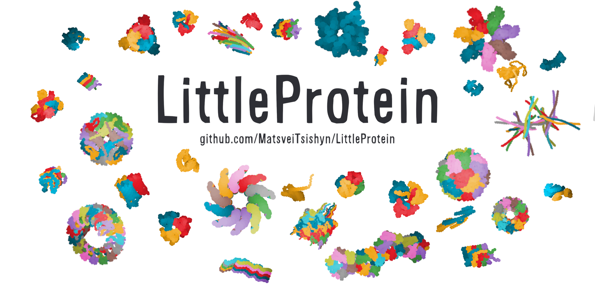

# LittleProtein

[](https://opensource.org/licenses/MIT)
<div style="text-align: center;">

</div>

**LittleProtein** is a **protein 3D structure viewer** that runs in your web **browser**.  
It creates a canvas within an HTML page where you can display and interact with a protein 3D structure.
It is written in JavaScript and uses the [p5.js](https://p5js.org/) library to facilitate display and interactivity.
The goal of the project is to provide a cute little viewer for everyone to play with protein 3D structures and to get coarse-grain schematic graphics of your favorite structures (like the ones shown in the image above).  

Author: Matsvei Tsishyn

## Usage

### (1) Just play

**Download** the project and **just click** on `demo.html` to open it in a web browser.  
You will see an example of a protein 3D structure, but you can **drag and drop** any `.pdb` file you have. For instance, you can find some `.pdb` files on the [Protein Data Bank](https://www.rcsb.org/) and on the [AlphaFoldDB](https://alphafold.com/).
Use mouse, left click, mouse wheel and Shift button to interact with the canvas.  

### (2) Include to your own web page

To include LittleProtein in your own web site, just include `littleprotein.js` script in your project.
You can then import the script and create a LittleProtein canvas with only a few lines of HTML/JavaScript:

```html
<!DOCTYPE html>
<head>
  <script src="littleprotein.js"></script>
</head>
<body>

  <div id="LittleProteinCanvas1"></div>  
  <script>
    const lpCanvas = LittleProteinStarter.start(
      "#LittleProteinCanvas1",  // ID to find the HTML div where to generate the canvas
      1200,                     // width (X coordinate) of the canvas
      800,                      // height (Y coordinate) of the canvas
    );
    lpCanvas.loadDemoProtein(); // Load default demo protein strucure
  </script>

</body>
</html>
```

### (3) Customize the canvas

Start from the `demo.html` example page as template to custom the LittleProtein canvas.

#### Display a different protein structure

First display an empty canvas with:
```JavaScript
const lpCanvas = LittleProteinStarter.start(
  "#LittleProteinCanvas1",
  1200,
  800
);
```
The user can then drag and drop a protein structure in the canvas.

You can display the demo protein structure with:
```JavaScript
lpCanvas.loadDemoProtein();
```

You can load a custom protein structure from a JavaScript string object in the `.pdb` format with:

```JavaScript
const myProtein = "\
ATOM      1  CA  ALA A   1      62.596  27.817  65.964  1.00 43.99           C  \n\
ATOM      2  CA  ASN A   2      62.033  24.076  65.700  1.00 40.93           C  \n\
"
lpCanvas.fromString(myProtein);
```

You can also fetch a PDB file directly from the [Protein Data Bank](https://www.rcsb.org/) or the [AlphaFoldDB](https://alphafold.com/) with:

```JavaScript
lpCanvas.fetch("1ACB");   // Fetch from the PDB using a PDB ID
lpCanvas.fetch("P08397"); // Fetch from the AlphaFoldDB using a UniProt ID
```

#### Custom display settings

You can change display settings with the following parameters:

```JavaScript
const lpCanvas = LittleProteinStarter.start(
  "#LittleProteinCanvas1",
  1200,
  800,
  { // display options
    "backgroundColor": [230, 150, 150], // set background color
    "depthShadeFactor": 2.0, // set strength of depth shading
    "viewDistance": 1.5, // set projection deformations strength
    "residuesScale": 2.0, // set residues display size
    "colorsList": [[238, 155,   0], [225,   0,  12]] // overwrite default list of colors
    "colorsMap": {"A": [50, 50, 50]}, // set map of colors for chains
  }
);
```

Alternatively, you can reset these parameters after initialization with:
```JavaScript
lpCanvas.setBackgroundColor([230, 150, 150]);
lpCanvas.setDepthShadeFactor(2.0);
lpCanvas.setViewDistance(1.5);
lpCanvas.setResiduesScale(2.0);
lpCanvas.setColorsList([[238, 155,   0], [225,   0,  12]]);
lpCanvas.setColorsMap({"A": [50, 50, 50]});
```

#### Set colors


- Chain-based Coloring (Default):
LittleProtein loop on the list `colorsList` to assign a different color for each different chain. When the last color is reached, the loop restarts at the first color.
You can override the default colors sequence by providing your own `colorsList` (see above).

- `colorsMap` Overrides:
If a specific chain is defined in the `colorsMap` (see above), its assigned color will override the default from `colorsList`.

- Manual Color Overrides:
You can override the color for a specific chain or an individual residue using:
```JavaScript
lpCanvas.setChainColor("A", [50, 50, 50]);
lpCanvas.setResidueColor("A13", [50, 50, 50]);
```

You can access each individual residue with:
```JavaScript
lpCanvas.proteinStructure.residues.forEach(res => {
  if(res.aa.three == "ALA"){
    lpCanvas.setResidueColor(res.resid, [  0,  15, 35]);
  }
});
```

## How LittleProtein works ?

XXX 2D Flat display. XXX (to be written)

## Build from source

The code is organized into multiple small JavaScript modules (separate `.js` files). These modules, along with `p5.min.js`, are bundled into a single file (`littleprotein.js`) for easier integration into web pages.

To build the `littleprotein.js` file from source, follow these steps:

- Download `p5.min.js` from the [p5.js download page](https://p5js.org/download/) and place it in the `./src/libs/` directory.

- Install [Node.js](https://nodejs.org/) and [npm](https://www.npmjs.com/) if not done yet.

- Use `npm` to initialize the project and install [Rollup](https://www.npmjs.com/package/rollup) (a node module which is essentially glorified copy-paste):
```bash
npm init
npm install --save-dev rollup
```

- Run the following command to bundle all scripts from `./src/` into a single portable file (`littleprotein.js`):
```bash
npx rollup -c
```
